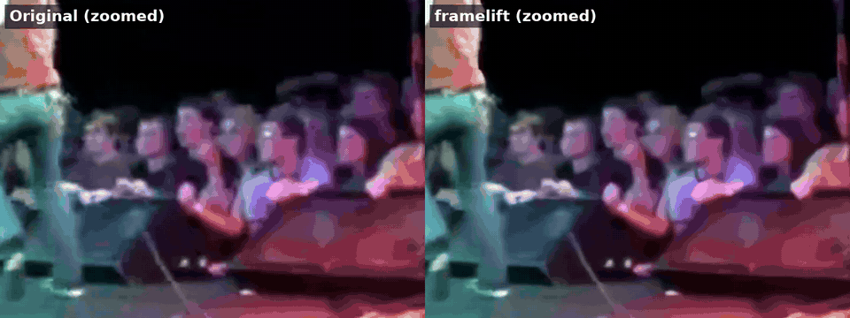
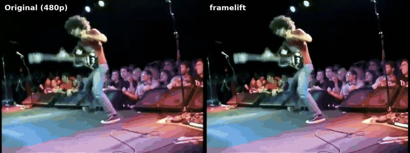

<div align="center">

# 🎬 framelift gallery

**Real before/after examples.**

[← Back to the README](README.md) · [Português 🇧🇷](GALLERY.pt-BR.md)

</div>

Each example shows the same area side by side: the original on the left (just stretched to
the same size), framelift on the right. The first GIF is a 100% crop of the most detailed
area; open **Full frame** to see the whole picture.

<sub>GIFs are compressed and scaled down for this page; the real MP4 output is sharper.</sub>

## Contents

- [Live rock show](#live-rock-show)
- [Color music video](#color-music-video)
- [Black-and-white concert footage](#black-and-white-concert-footage)
- [Add your own](#add-your-own)

## Live rock show

Fast motion, quick cuts and flashing stage lights: the hardest kind of footage in this
gallery. Faces in the crowd come out more defined and the blocky compression is cleaned up.
The motion blur stays, because no upscaler can undo it. 480p → 1080p.



<details>
<summary>Full frame</summary>



</details>

## Color music video

Cleaner strings and frets, and less compression blockiness. 480p → 1080p.


<details>
<summary>Full frame</summary>


</details>

## Black-and-white concert footage

Grain and blocky artifacts cleaned up, with crisper edges on faces and sunglasses.
480p → 1080p, enhanced on a laptop CPU.


<details>
<summary>Full frame</summary>


</details>

## Add your own

The GIFs on this page are made with a script in this repo. Run it from the repo root, with
the original video and framelift's output for it:

```bash
python scripts/make_comparison.py original.mp4 enhanced.mp4 --name my_clip
```

It picks the sharpest steady scene (fast motion and cuts make a jumpy zoom), zooms into its
most detailed area, lowers the frame rate and size until each GIF is under 6 MB, and prints
the Markdown to paste here. It writes to `docs/gallery/`: two GIFs to commit, plus the same
two as MP4s in full quality for sharing (`.gitignore` keeps those out of git).

If you'd rather choose the zoom yourself, `--zoom X,Y,W,H` sets the region (in pixels of
the original video) and `--start`/`--end` set the scene (in seconds).
