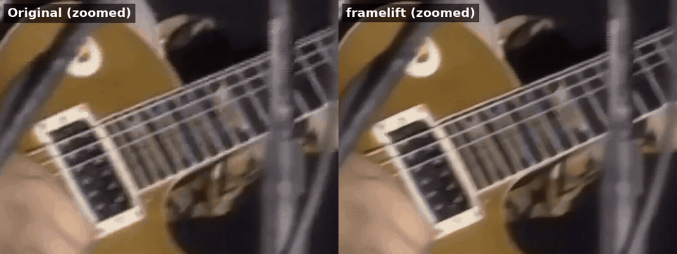
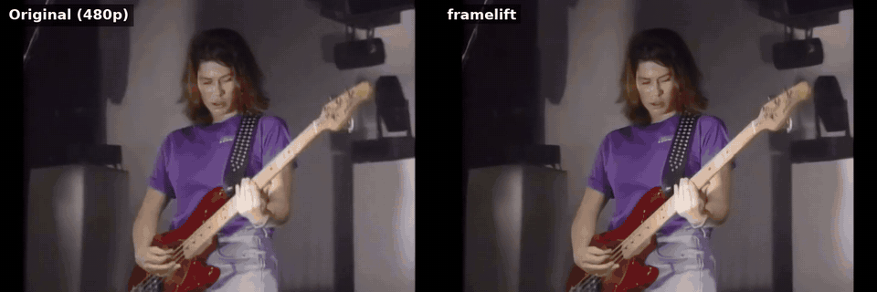
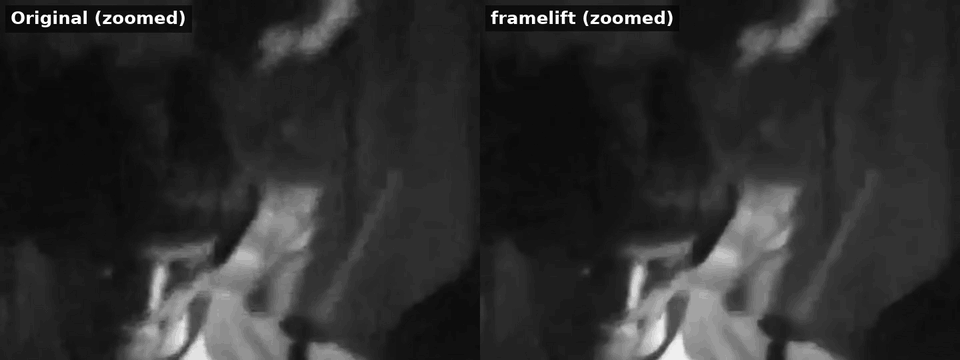
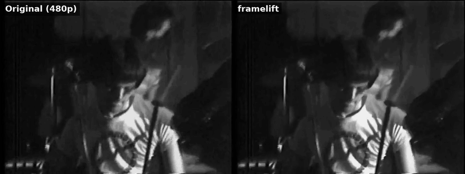
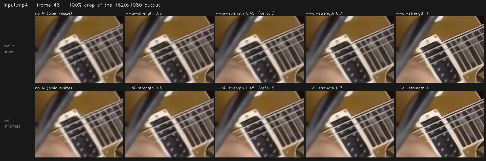

<div align="center">

# 🎞️ framelift

**Upscale and restore videos with Real-ESRGAN — on an NVIDIA GPU if you have one, on any CPU if you don't.**

[](https://github.com/pedrodatasci/framelift/actions/workflows/tests.yml)


[Português 🇧🇷](README.pt-BR.md) · [🎬 More examples](GALLERY.md)

</div>

framelift takes an old, blurry or low-resolution video and runs every frame through
[Real-ESRGAN](https://github.com/xinntao/Real-ESRGAN), a neural network trained to
restore detail. Instead of handing you the raw AI output (which can look plasticky),
it **blends** it with a classic high-quality resize, so the result stays faithful to
the original footage.

```bash
framelift -i grandma_1998.mp4 -o grandma_1998_hd.mp4 --profile old_tv --scale 2
```

## Before / after

Two real clips, both upscaled from 480p to 1080p. Each GIF shows the same area side by
side: the original on the left (just stretched to the same size), framelift on the right.

**Color music video:** cleaner strings and frets, less compression blockiness.



<details>
<summary>Full frame</summary>



</details>

**Black-and-white concert footage:** grain and blocky artifacts cleaned up, crisper edges.
Enhanced on a laptop CPU.



<details>
<summary>Full frame</summary>



</details>

<sub>GIFs are compressed and scaled down for this page; the real MP4 output is sharper.</sub>

**[🎬 More examples in the gallery →](GALLERY.md)**

## Highlights

- **Works on any machine.** Uses CUDA when available and falls back to the CPU
  otherwise — Intel Iris laptops included.
- **Stop anytime, lose nothing.** Press <kbd>Ctrl</kbd>+<kbd>C</kbd> once and framelift
  finishes the current frame and saves a **playable** MP4 of everything done so far.
  It then tells you exactly how to resume.
- **Natural-looking results.** The `--ai-strength` blend lets you dial in anything from
  "subtle cleanup" to "full AI".
- **Pre-cleaning profiles** for common sources: phone footage, VHS/TV captures, very
  noisy video.
- **Fast pipeline.** Frames are decoded on a background thread while the AI works, and
  streamed straight into FFmpeg: no temporary image files on disk.
- **Frame-rate conversion.** Turn 24/30 fps into 60 fps without changing the duration.
- **A real Python library**, not just a script: `enhance_video(...)`, typed options,
  structured results and specific exceptions.
- **Models download themselves** on first use.

## Contents

- [Before / after](#before--after) (and [more examples](GALLERY.md))
- [How it works](#how-it-works)
- [Installation](#installation)
- [Quick start](#quick-start)
- [Finding the best settings (`framelift tune`)](#finding-the-best-settings-framelift-tune)
- [Recipes](#recipes)
- [Command-line reference](#command-line-reference)
- [Models](#models)
- [Pre-cleaning profiles](#pre-cleaning-profiles)
- [Performance tuning](#performance-tuning)
- [Stopping, resuming and joining parts](#stopping-resuming-and-joining-parts)
- [Adding the audio back](#adding-the-audio-back)
- [Python API](#python-api)
- [Troubleshooting](#troubleshooting)
- [Project layout](#project-layout)
- [Development](#development)
- [Coming from the old `main.py`](#coming-from-the-old-mainpy)
- [Credits and license](#credits-and-license)

## How it works

```
┌───────────────┐  queue   ┌─────────────┐      ┌─────────────────┐  pipe   ┌────────┐
│ reader thread │ ───────► │ Real-ESRGAN │ ───► │ blend with      │ ──────► │ FFmpeg │ ──► out.mp4
│ decode+clean  │(prefetch)│  (GPU/CPU)  │      │ Lanczos resize  │  (raw)  │  H.264 │
└───────────────┘          └─────────────┘      └─────────────────┘         └────────┘
```

1. **Read and pre-clean.** A background thread decodes frames and applies the chosen
   [profile](#pre-cleaning-profiles), staying a few frames ahead of the AI.
2. **Upscale.** Real-ESRGAN restores detail and enlarges the frame to the target size.
3. **Blend.** The AI result is mixed with a plain Lanczos resize of the same frame,
   according to `--ai-strength`.
4. **Encode.** Raw frames are piped into FFmpeg (libx264 or NVENC). The file is written
   under a temporary name and only renamed once FFmpeg finishes cleanly.

Before committing to hours of work, framelift checks that the first frame isn't
black — both before and after the AI — which catches broken decodes, corrupt weights
and driver problems early.

## Installation

You need **Python 3.9+** and **[FFmpeg](https://ffmpeg.org/download.html)** available
on your `PATH` (`ffmpeg -version` should work in a terminal).

```bash
git clone https://github.com/pedrodatasci/framelift.git
cd framelift
python -m venv .venv
source .venv/bin/activate          # Windows: .venv\Scripts\activate
```

**Using an NVIDIA GPU?** Install a CUDA build of PyTorch *first*, using the command
that [pytorch.org](https://pytorch.org/get-started/locally/) gives you for your system.
Skip this step for CPU-only machines.

Then install framelift:

```bash
pip install -r requirements.txt    # optional: the exact, known-good versions
pip install -e .
framelift --version
```

This gives you the `framelift` command. `python -m framelift` works too.

## Quick start

```bash
# 1. Let framelift measure your video and machine (prints a fast and a best command)
framelift tune -i input.mp4

# 2. Try it on the first ~10 seconds (300 frames at 30 fps) to judge the look quickly
framelift -i input.mp4 -o preview.mp4 --max-frames 300

# 3. Happy with it? Run the whole thing
framelift -i input.mp4 -o output.mp4
```

The defaults are a good starting point: the fast `realesr-animevideov3` model, a 1.5x
upscale and a 45% AI blend.

> [!NOTE]
> The output is a **silent** MP4. See [Adding the audio back](#adding-the-audio-back)
> for a one-line fix.

## Finding the best settings (`framelift tune`)

Small changes in the settings can change the result a lot, and the right values depend on
*your* footage. Let framelift measure them:

```bash
framelift tune -i input.mp4
```

It takes a minute or two (longer on a slow CPU with big videos) and works in five steps:

1. **Looks at your footage.** On frames spread across the video it measures **softness**
   (how blurry the picture is), **noise** (which picks the clean-up profile) and
   resolution (which picks a scale that lands on Full HD without stretching more than 3x).
   For the tests it picks the sharpest *steady* frame, skipping fast motion and scene cuts.
2. **Measures your machine.** It upscales a real frame with each candidate setup and keeps
   the fastest one that fits in memory: tile sizes, FP16 on NVIDIA (double-checked without
   it, since FP16 is slower on some older cards) and, on CPU, **the number of threads**
   (laptops that mix fast and efficiency cores are often faster with fewer). It also checks
   whether NVENC works.
3. **Measures what the AI does to your footage.** This is where it adapts to the input.
   Small crops are upscaled with and without AI, and three things are measured:
   - **sharpness:** how much the AI actually brings back compared with a plain resize;
   - **noise:** whether the AI cleans noise up or invents grain and texture;
   - **structure:** whether it restores the picture or starts redrawing details.

   Those decide the **AI strength**, separately for each model. A soft source where the AI
   recovers a lot gets a high strength. An already-sharp source, or a model that invents
   texture on this footage, gets a lower one.
4. **Builds two presets**, each with its own time estimate:
   - **`fast`**: the light video model (`realesr-animevideov3`). Usually minutes.
   - **`best`**: a heavier model (`realesrgan-x4plus`, or the anime model with `--anime`)
     that recovers more detail, plus more careful settings: `--pre-pad 10` against edge
     artifacts, `--crf 18` so the encoder keeps more detail, and a slower x264 preset.
     On a CPU it can be around 30x slower.

   `best` is recommended when it's estimated to finish within 10 minutes (short clips, or
   a GPU); otherwise `fast` is.
5. **Makes a comparison sheet** (`input_tune.png`): the same 100% crop rendered with each
   preset (rows) and different AI strengths (columns), with each preset's pick marked.

Here's the real sheet for the color music video above. The bottom row is the `best` preset:
notice the sharper studs on the strap. Click it to see it at full size.



And the report it printed (a real run on a single-core test machine, so the times are long):

```
Your machine
  CPU (no NVIDIA GPU in use, so expect it to be slow)

Your video
  input.mp4  720x480 @ 29.970 fps, 92 frames (0m03s)
  Softness  soft (0.48)
  Noise     very clean (0.4) → profile none
  Size      480p → 1080p → --scale 2.25
  Tested on frame 37 (the sharpest steady one)

What the AI does to it
  animevideov3  sharpness +0.10 · noise -0.2 · structure 0.96  → AI strength 0.5
                recovers some sharpness
  x4plus        sharpness +0.20 · noise +0.2 · structure 0.96  → AI strength 0.6
                recovers sharpness well

Speed test (animevideov3, 1620x1080 output)
  tile 256, FP32               5.85 s/frame
  tile 128, FP32               4.34 s/frame  ← fastest

Presets
  fast  animevideov3 · AI 0.5 · ~7 min  (light video model)  ← recommended
  best  x4plus · AI 0.6 · ~3h56  (heavier model, more careful encoding)
  Times are rough: they don't include loading the model or encoding.

Comparison sheet: /home/you/input_tune.png
  The same 100% crop of frame 37: columns are AI strengths
  (the presets' picks are marked), rows are the presets. Adjust to taste.

Commands
  fast (recommended):
    framelift -i input.mp4 -o input_enhanced.mp4 --scale 2.25 --ai-strength 0.5 --device cpu --tile 128 --x264-preset medium
  best:
    framelift -i input.mp4 -o input_enhanced_best.mp4 --model realesrgan-x4plus --scale 2.25 --ai-strength 0.6 --device cpu --tile 128 --pre-pad 10 --crf 18 --x264-preset slow
```

Good to know:

- **Faster vs. better is about the model, not the AI strength.** The AI strength is only a
  blend at the end, so it costs no time at all. The presets differ in model and encoding
  effort; each gets the strength that suits it on your footage.
- **Anything you pass is kept.** `framelift tune -i vhs.mp4 --scale 2 --profile old_tv`
  keeps your scale and profile, tunes everything else, and marks yours as "(yours)". With
  `--model`, only that model is tuned (no fast/best choice).
- **The measurements are a strong starting point; the sheet has the final word.** The
  strength rules were calibrated on a handful of clips (sharp, blurry and grainy synthetic
  video, plus real old footage), and taste still matters. Pick the tile of the sheet you
  like best and adjust `--ai-strength` to match.
- **Grain and blotches aren't the same thing.** Old footage often shows blotchy patches in
  dark areas, left by earlier compression. They aren't pixel noise, so the noise check
  doesn't count them and suggests no clean-up profile; step 3 measures how the AI deals
  with them. If they bother you, run tune again with `--profile soft_camera` and compare
  the sheets.
- **The time estimates are rough.** They count the AI and the pre-cleaning, but not loading
  the model or encoding. In our tests the real run took about 15% longer. On CPU, `best`
  is extrapolated from a smaller test.
- **The first run downloads the heavier model** (67 MB). `--no-best` skips it and tunes
  only the `fast` preset.
- **On slow CPUs with Full HD or larger videos, the speed test itself can take several
  minutes.** `--no-benchmark` skips it and still gives you the measurements, the presets
  (without time estimates) and the sheet.
- **Both presets write to different files** (`_enhanced.mp4` and `_enhanced_best.mp4`), so
  you can run both on a short clip and compare.

| Flag | Default | Description |
| --- | --- | --- |
| `-i`, `--input VIDEO` | *required* | Video to analyse. |
| `-o`, `--output MP4` | `<input>_enhanced.mp4` | Only used to write the suggested commands (`best` adds `_best`). |
| `--samples N` | `6` | Frames spread across the video that are inspected for noise, softness and motion. |
| `--sheet PNG` | `<input>_tune.png` | Where to save the comparison sheet (in the current folder by default). |
| `--no-sheet` | off | Don't make a comparison sheet. |
| `--no-benchmark` | off | Skip the speed test: much faster on CPU, but no tile/FP16/thread tuning and no time estimates. |
| `--no-best` | off | Only tune the `fast` preset: skips the heavier model and its download. |
| `--anime` | off | The video is animation: the `best` preset uses `realesrgan-x4plus-anime-6B`. |
| `--model`, `--device`, `--gpu-id`, `--weights-dir`, `--torch-threads`, `--profile`, `--scale`, `--same-resolution`, `--ai-strength`, `--tile`, `--half`, `--encoder`, `--start-frame`, `--max-frames` | not set | Same meaning as in the main command. Whatever you pass is kept as-is and carried into the suggested commands. `--start-frame` and `--max-frames` change the time estimates. |
| `-v`, `-q` | | More detail / only the final report. |

Exit codes are the same as the main command; <kbd>Ctrl</kbd>+<kbd>C</kbd> cancels with code 130.

## Recipes

| Goal | Command |
| --- | --- |
| Quick preview | `framelift -i in.mp4 -o prev.mp4 --max-frames 300` |
| Old VHS / TV capture | `framelift -i vhs.mp4 -o out.mp4 --profile old_tv --scale 2 --ai-strength 0.5` |
| Phone video, subtle cleanup | `framelift -i phone.mp4 -o out.mp4 --profile soft_camera --ai-strength 0.3` |
| Very noisy footage | `framelift -i noisy.mp4 -o out.mp4 --profile heavy_noise` |
| Anime / cartoons | `framelift -i ep01.mp4 -o out.mp4 --model realesrgan-x4plus-anime-6B --scale 2 --ai-strength 0.8` |
| Maximum detail (slow) | `framelift -i in.mp4 -o out.mp4 --model realesrgan-x4plus --ai-strength 0.6` |
| Restore without resizing | `framelift -i in.mp4 -o out.mp4 --same-resolution` |
| Convert to 60 fps | `framelift -i in.mp4 -o out.mp4 --output-fps 60` |
| NVIDIA GPU, full speed | `framelift -i in.mp4 -o out.mp4 --device cuda --half --tile 768 --encoder nvenc` |
| Intel laptop (CPU) | `framelift -i in.mp4 -o out.mp4 --device cpu --tile 128 --torch-threads 8` |
| Resume after frame 1200 | `framelift -i in.mp4 -o part2.mp4 --start-frame 1201` |

## Command-line reference

```
framelift -i INPUT -o OUTPUT [options]
```

Run `framelift --help` for the same information in your terminal.

### Input / output

| Flag | Default | Description |
| --- | --- | --- |
| `-i`, `--input VIDEO` | *required* | Video to enhance. Anything OpenCV/FFmpeg can read (MP4, MKV, AVI, MOV…). |
| `-o`, `--output MP4` | *required* | Where to save the result. Parent folders are created automatically. An existing file at this path is replaced **only** once the new one has finished successfully. |

### How the result looks

| Flag | Default | Description |
| --- | --- | --- |
| `--model NAME` | `realesr-animevideov3` | Real-ESRGAN model. See [Models](#models) or `framelift --list-models`. |
| `--scale FACTOR` | `1.5` | Output size relative to the input: `2` doubles width and height, `1.25` adds 25%. Values below 1 shrink the video (still cleaned by the AI). Ignored with `--same-resolution`. |
| `--same-resolution` | off | Keep the exact input resolution. Useful to restore quality without making the file bigger. |
| `--ai-strength N` | `0.45` | Share of the AI result in the final image, from `0` to `1`. `1.0` = pure AI (sharpest, can look artificial); `0.45` = balanced; `0.30` = natural; `0` = plain Lanczos resize. Values outside 0–1 are clamped. |
| `--profile NAME` | `none` | Clean-up filter applied *before* the AI. See [Pre-cleaning profiles](#pre-cleaning-profiles) or `framelift --list-profiles`. |
| `--output-fps FPS` | same as input | Output frame rate. Higher values repeat frames in an even pattern so the **duration stays the same** (e.g. 24 → 60 fps writes each frame 2 or 3 times). It can't be lower than the input's rate. This doesn't create new motion (it isn't interpolation), but it's handy when a platform or editor expects 60 fps. |

### Which frames to process

| Flag | Default | Description |
| --- | --- | --- |
| `--start-frame N` | `1` | First frame to process, counting from **1**. Used to resume an interrupted run: if the last frame done was 1200, pass `1201`. |
| `--max-frames N` | all | Process at most `N` frames starting at `--start-frame`. Ideal for previews and for splitting long jobs into sessions. |

### Hardware and performance

| Flag | Default | Description |
| --- | --- | --- |
| `--device {auto,cpu,cuda}` | `auto` | Where the AI runs. `auto` picks an NVIDIA GPU if PyTorch can see one, otherwise the CPU. Use `cpu` on Intel/AMD graphics and Apple machines. `cuda` fails with a clear message if no GPU is available. |
| `--gpu-id ID` | `0` | Which CUDA GPU to use on multi-GPU machines (`nvidia-smi` lists the IDs). |
| `--half` | off | Run the model in FP16 on the GPU: faster and roughly half the VRAM, with no visible quality loss. Ignored (with a note) on CPU. |
| `--tile PX` | `256` | Split each frame into square tiles of this size before running the AI, which bounds memory use. **Lower it** if you run out of memory; **raise it** on a big GPU for speed. `0` processes the whole frame at once. See [Performance tuning](#performance-tuning). |
| `--tile-pad PX` | `10` | Overlap between neighbouring tiles, which hides seams. Rarely needs changing. |
| `--pre-pad PX` | `0` | Padding added around the whole frame before inference. A small value (e.g. `10`) can reduce artifacts at the very edges of the image. |
| `--torch-threads N` | `0` | Number of CPU threads PyTorch may use. `0` lets PyTorch decide (usually all cores). Setting it to your *physical* core count can help on some laptops. |
| `--prefetch N` | `2` | How many pre-cleaned frames the reader thread keeps ready. Raise it (e.g. `4`–`8`) with slow profiles like `heavy_noise` on a fast GPU. Each frame costs a little RAM. |
| `--weights-dir DIR` | `weights` | Folder where model files are stored. Missing models are downloaded here automatically on first use (relative to the current directory). |

### Encoding

| Flag | Default | Description |
| --- | --- | --- |
| `--encoder {cpu,nvenc}` | `cpu` | `cpu` uses libx264 and works everywhere. `nvenc` uses the NVIDIA hardware encoder (faster, frees the CPU). If NVENC isn't usable — no NVIDIA GPU, running with `--device cpu`, or an FFmpeg build without it — framelift explains why and falls back to `cpu`. |
| `--crf N` | `20` | Quality target. **Lower = better quality and bigger files.** 18 is visually lossless for most footage, 18–22 is the sweet spot, above 26 artifacts start to show. With `nvenc` this value is passed as `-cq`. |
| `--x264-preset NAME` | `veryfast` | libx264 speed/size trade-off: `ultrafast`, `superfast`, `veryfast`, `faster`, `fast`, `medium`, `slow`. Slower presets give smaller files at the same quality. Since the AI is usually the bottleneck, `medium` often costs little extra time. Only used by the `cpu` encoder. |

### Diagnostics

| Flag | Default | Description |
| --- | --- | --- |
| `--debug-timings` | off | Periodically print how long each stage takes (waiting for the queue, AI, blend, write). On CUDA it synchronizes the GPU so the numbers are real, which costs a little speed. |
| `--timing-every N` | `20` | With `--debug-timings`: report every `N` frames. |
| `--gc-every N` | `0` | With `--debug-timings`: run Python's garbage collector and release cached GPU memory every `N` frames. `0` = never. A diagnostic tool for suspected memory growth. |
| `-v`, `--verbose` | off | Show extra detail: FFmpeg commands, file paths, sanity-check values and full tracebacks on unexpected errors. |
| `-q`, `--quiet` | off | Only show warnings and errors (the progress bar stays). |

### Information

| Flag | Description |
| --- | --- |
| `--list-models` | Describe the available models and exit. |
| `--list-profiles` | Describe the pre-cleaning profiles and exit. |
| `--version` | Print the version and exit. |
| `-h`, `--help` | Show all options with examples. |

### Legacy (accepted but ignored)

| Flag | Why it still exists |
| --- | --- |
| `--frame-format` | Earlier versions saved frames as images. Frames now go straight to FFmpeg, so this does nothing; it's accepted so old commands keep running. |
| `--keep-temp` | Same story: there are no temporary frame files to keep anymore. |

### Exit codes

| Code | Meaning |
| --- | --- |
| `0` | Success — including a partial video saved after a single <kbd>Ctrl</kbd>+<kbd>C</kbd>. |
| `1` | Error (missing file, invalid option, FFmpeg failure, out of memory…). The message says what to do. |
| `2` | Invalid command-line usage (unknown flag, bad choice). |
| `130` | Stopped immediately with a second <kbd>Ctrl</kbd>+<kbd>C</kbd>. |

## Models

| Name | Best for | Speed | Notes |
| --- | --- | --- | --- |
| `realesr-animevideov3` *(default)* | Video in general, animation | ⚡⚡⚡ | Tiny network made for video, and by far the fastest. Start here. |
| `realesrgan-x4plus` | Real-world footage | 🐢 | The most detail, but slow: about 27x slower than the default on a CPU in our tests. Can invent textures; pair with a lower `--ai-strength`. |
| `realesrnet-x4plus` | Real-world footage, smoother look | 🐢 | Same size as x4plus, fewer invented textures. |
| `realesrgan-x4plus-anime-6B` | Anime, cartoons, illustrations | ⚡⚡ | Keeps flat colors and clean lines. |

All models are trained at 4x. framelift then resizes to your `--scale`, so you don't
have to output 4x-sized video. Weights (about 2.5 MB for the default model, 18 MB for the
anime model and 67 MB for the other two) are downloaded automatically from the official
Real-ESRGAN releases the first time a model is used.

## Pre-cleaning profiles

The AI enhances *everything*, including noise and compression blocks. A light
clean-up first usually gives a more natural result.

| Profile | What it does | Use it for | Cost |
| --- | --- | --- | --- |
| `none` *(default)* | Nothing. | Clean sources. | free |
| `minimal` | +2% contrast and saturation, a light sharpen. | Slightly dull footage. | ~free |
| `soft_camera` | Gentle edge-preserving smoothing (bilateral), mild color lift, sharpen. | Phone and webcam video with fine grain. | low |
| `old_tv` | Stronger bilateral smoothing, more contrast and color. | VHS, DVD rips, TV captures. | low |
| `heavy_noise` | Non-local-means denoising, then tone and sharpen. | Very grainy, low-light or heavily compressed video. | **high** (CPU) |

`heavy_noise` runs on the CPU in the reader thread. On a fast GPU it can become the
bottleneck; raising `--prefetch` helps a bit.

## Performance tuning

The AI step dominates the run time. The quickest way to tune it is
[`framelift tune`](#finding-the-best-settings-framelift-tune), which measures it on your
machine. Otherwise, rough guidance:

| Hardware | Suggested settings |
| --- | --- |
| NVIDIA, 8 GB+ VRAM | `--device cuda --half --tile 768` (or `--tile 0` if it fits) `--encoder nvenc` |
| NVIDIA, 4–6 GB VRAM | `--device cuda --half --tile 384` |
| CPU / Intel Iris / AMD / Apple | `--device cpu --tile 128` or `256`, default model, and see the thread tip below |

- **Out of memory?** Halve `--tile`. That's the main memory knob.
- **Where does the time go?** Add `--debug-timings`. A large `queue` time means the
  reader (profile) is the bottleneck; large `ai` means the model is; large `write`
  means the encoder is (try `--encoder nvenc` or a faster `--x264-preset`).
- **The model matters more than anything else:** `realesr-animevideov3` was about 27x
  faster than `realesrgan-x4plus` on a CPU in our tests.
- **`--scale` barely affects speed.** The models always upscale 4x internally and resize to
  your scale at the end, so 1080p output costs about the same AI time as 720p.
- **More CPU threads isn't always faster.** On laptops that mix performance and efficiency
  cores, a lower `--torch-threads` (say 4–6) can beat using them all. `framelift tune`
  tests this for you. Keep the laptop plugged in and out of power-saving mode, too.
- On CPU, expect roughly seconds per frame rather than frames per second. Test with
  `--max-frames` first to estimate the total time.

## Stopping, resuming and joining parts

Press <kbd>Ctrl</kbd>+<kbd>C</kbd> **once**: framelift finishes the frame it's working on,
closes the MP4 properly and prints something like:

```
Saved a partial video /videos/out.mp4
  frames 1 → 1200 (1200 enhanced, 1200 written) in 42m10s
To continue from here, run again with:  --start-frame 1201
```

Press it **twice** to quit immediately (exit code 130). FFmpeg is still allowed to close
its file, which is left as `out.encoding_tmp.mp4`.

To continue, run the same command with a **new output name** and the suggested start:

```bash
framelift -i in.mp4 -o part2.mp4 --start-frame 1201
```

Then join the parts losslessly with FFmpeg:

```bash
printf "file 'out.mp4'\nfile 'part2.mp4'\n" > parts.txt
ffmpeg -f concat -safe 0 -i parts.txt -c copy joined.mp4
```

> [!TIP]
> `--start-frame` together with `--max-frames` lets you split a long job into sessions
> on purpose, e.g. 5000 frames per night.

## Adding the audio back

framelift writes video only. Copy the audio from the original without re-encoding:

```bash
ffmpeg -i output.mp4 -i input.mp4 -map 0:v -map 1:a? -c copy -shortest final.mp4
```

The `?` makes it work even if the input has no audio. This lines up correctly when the
output covers the whole video (from frame 1).

## Python API

Everything the CLI does is available from Python, with the same option names
(`--ai-strength` → `ai_strength`).

### One call

```python
from framelift import enhance_video

result = enhance_video("in.mp4", "out.mp4", scale=2, profile="old_tv", ai_strength=0.5)

print(f"{result.frames_written} frames written in {result.elapsed_seconds:.0f}s")
if result.resume_from:
    print("Continue later with start_frame =", result.resume_from)
```

### Reusable settings and batch processing

`VideoEnhancer` loads the model once and reuses it for every video:

```python
from pathlib import Path
from framelift import EnhanceOptions, VideoEnhancer

enhancer = VideoEnhancer(EnhanceOptions(scale=2, profile="soft_camera", device="cuda", half=True))

for clip in Path("raw").glob("*.mp4"):
    enhancer.enhance(clip, Path("enhanced") / clip.name)
```

### Stopping from code

Pass a `threading.Event`; setting it has the same effect as one Ctrl+C:

```python
import threading
from framelift import enhance_video

stop = threading.Event()
threading.Timer(600, stop.set).start()  # give up after 10 minutes, keep what's done

result = enhance_video("long.mp4", "out.mp4", stop_event=stop)
print("interrupted:", result.interrupted)
```

### Messages and progress

framelift uses the standard `logging` module under the `"framelift"` logger and prints
nothing on its own, apart from the progress bar. To see the same friendly output as the
CLI:

```python
import framelift

framelift.setup_console(verbosity=0)  # -1 = warnings only, 1 = debug
```

Pass `show_progress=False` to hide the progress bar.

### Handling errors

All errors inherit from `framelift.FrameliftError`:

| Exception | When |
| --- | --- |
| `InvalidOptionError` | An option can't work (also a `ValueError`). |
| `VideoReadError` | The input is missing, unreadable or has no frame rate. |
| `MissingDependencyError` | FFmpeg or the Real-ESRGAN packages aren't installed. |
| `OutOfMemoryError` | The model ran out of memory; retry with a smaller `tile`. |
| `EncodingError` | FFmpeg failed. |
| `BlackFrameError` | The first frame is black before or after the AI. |
| `NothingToDoError` | No frame was processed. |

```python
from framelift import EnhanceOptions, OutOfMemoryError, VideoEnhancer

options = EnhanceOptions(device="cuda", tile=1024)
while True:
    try:
        VideoEnhancer(options).enhance("in.mp4", "out.mp4")
        break
    except OutOfMemoryError:
        if options.tile <= 64:
            raise  # even tiny tiles don't fit: give up
        options.tile //= 2
        print("Out of memory, retrying with tile", options.tile)
```

### Finding settings from code

```python
from framelift import enhance_video, tune_video

report = tune_video("clip.mp4", sheet_path="clip_tune.png")
print(report.softness_label, "→ recommended:", report.recommended_preset)

for name, preset in report.presets.items():
    print(name, preset.options.model, preset.options.ai_strength, preset.estimated_seconds)

enhance_video("clip.mp4", "clip_hd.mp4", report.presets["fast"].options)
```

`report.recommended` is the recommended preset's options, and `report.model_tests` holds
what each model measurably does to the footage. Pass `options=EnhanceOptions(...)` as a
starting point and `keep={"profile", "scale"}` to pin settings you've already decided on.
`try_best=False` skips the heavier model, `content="anime"` picks the anime model for the
`best` preset, and `benchmark=False` skips the speed test.

### Building blocks

The pieces are usable on their own too:

```python
import cv2
from framelift import (
    EnhanceOptions,
    apply_profile,
    estimate_noise,
    plan_run,
    probe_video,
    softness,
    suggest_size,
)

info = probe_video("in.mp4")  # fps, frame_count, width, height
plan = plan_run(info, EnhanceOptions(scale=2))  # sizes/ranges, without running anything
cleaned = apply_profile(cv2.imread("frame.png"), "old_tv")
noise = estimate_noise(cleaned)  # ~0 = clean, 10+ = very noisy
blur = softness(cleaned)  # ~0.15 = sharp, 0.5+ = soft
suggest_size(640, 360).scale  # 3.0 (360p → 1080p)
```

More in [`examples/`](examples/).

## Troubleshooting

**`Couldn't find 'ffmpeg' on your PATH`** — Install FFmpeg and open a new terminal.
On Windows, add the folder containing `ffmpeg.exe` to `PATH`.

**`You asked for --device cuda, but PyTorch can't see a CUDA GPU`** — Either there's no
NVIDIA GPU (use `--device cpu`), or you have the CPU-only PyTorch build. Check with
`python -c "import torch; print(torch.cuda.is_available())"` and reinstall PyTorch from
[pytorch.org](https://pytorch.org/get-started/locally/).

**`Ran out of memory while upscaling`** — Lower `--tile` (256 → 128 → 64). On CUDA,
`--half` roughly halves memory use.

**`No module named 'torchvision.transforms.functional_tensor'`** — A known
incompatibility between `basicsr` and torchvision 0.17+. framelift patches it
automatically when it loads a model, so if you see it, it comes from code that imports
`basicsr` or `realesrgan` directly, not from framelift.

**`The first frame is almost completely black`** — Checked *before* the AI, it means
decoding or the profile is the problem: try `--profile none`, or re-encode the input
with FFmpeg. *After* the AI, suspect a corrupt weights file (delete it from `weights/`
to re-download) or a GPU driver issue (compare with `--device cpu`).

**`--output-fps … is lower than the input's`** — Lowering the frame rate isn't
supported. Leave `--output-fps` out, or convert the input first with
`ffmpeg -i in.mp4 -r 30 in30.mp4`.

**It's very slow** — See [Performance tuning](#performance-tuning). On CPU, this is
expected; use the default model and preview with `--max-frames`.

**The output is shorter than expected** — Some files report a wrong frame count in
their metadata. framelift processes until the decoder stops, and the summary shows what
was actually read.

## Project layout

```
framelift/
├── src/framelift/
│   ├── cli.py         # command-line interface and Ctrl+C handling
│   ├── pipeline.py    # VideoEnhancer / enhance_video: orchestrates a run
│   ├── tuning.py      # tune_video: speed test, AI-effect test, presets, sheet
│   ├── analysis.py    # noise, softness, motion and AI-effect measurements; sheet
│   ├── tune_cli.py    # the `framelift tune` subcommand
│   ├── planning.py    # RunPlan / EnhanceResult: sizes, ranges, frame rates
│   ├── options.py     # EnhanceOptions: every setting, validated
│   ├── video.py       # probing + background FrameReader
│   ├── filters.py     # pre-cleaning profiles (declarative recipes)
│   ├── frames.py      # resize, blend, brightness, fps cadence
│   ├── upscaler.py    # Real-ESRGAN wrapper
│   ├── models.py      # model catalog + safe weight downloads
│   ├── device.py      # CUDA/CPU selection and PyTorch tuning
│   ├── encoder.py     # FFmpegWriter: raw frames → MP4
│   ├── console.py     # friendly terminal output that respects the progress bar
│   └── errors.py      # exception hierarchy
├── tests/             # pytest suite (runs without PyTorch)
├── examples/          # runnable usage examples
├── scripts/           # make_comparison.py: before/after GIFs for the gallery
├── docs/              # images and GIFs used by the READMEs and the gallery
├── GALLERY.md         # more before/after examples
└── main.py            # backwards-compatible entry point
```

Heavy dependencies are only imported when needed, so `framelift --help` and
`import framelift` are instant, and most of the test suite runs without PyTorch.

## Development

```bash
pip install -e ".[dev]"
pytest                 # full suite (the end-to-end tests need PyTorch + Real-ESRGAN)
pytest -m "not slow"   # fast unit tests only, no PyTorch needed
ruff check . && ruff format --check .
```

CI runs the fast suite and the linter on Python 3.9–3.12 for every push.

## Coming from the old `main.py`

Nothing breaks: every flag kept its name and default, and `python main.py …` still
works. The output was verified frame by frame (MD5 of every decoded frame) against the
original script across profiles, scales, frame-rate conversion, resume and tiling
settings. What changed — including a few bug fixes — is listed in the
[CHANGELOG](CHANGELOG.md).

## Credits and license

- [Real-ESRGAN](https://github.com/xinntao/Real-ESRGAN) by Xintao Wang et al. (BSD-3-Clause),
  which does the actual super-resolution. Model weights are distributed by that project
  under its terms.
- [BasicSR](https://github.com/XPixelGroup/BasicSR), [PyTorch](https://pytorch.org),
  [OpenCV](https://opencv.org) and [FFmpeg](https://ffmpeg.org).

framelift itself is released under the [MIT License](LICENSE).
